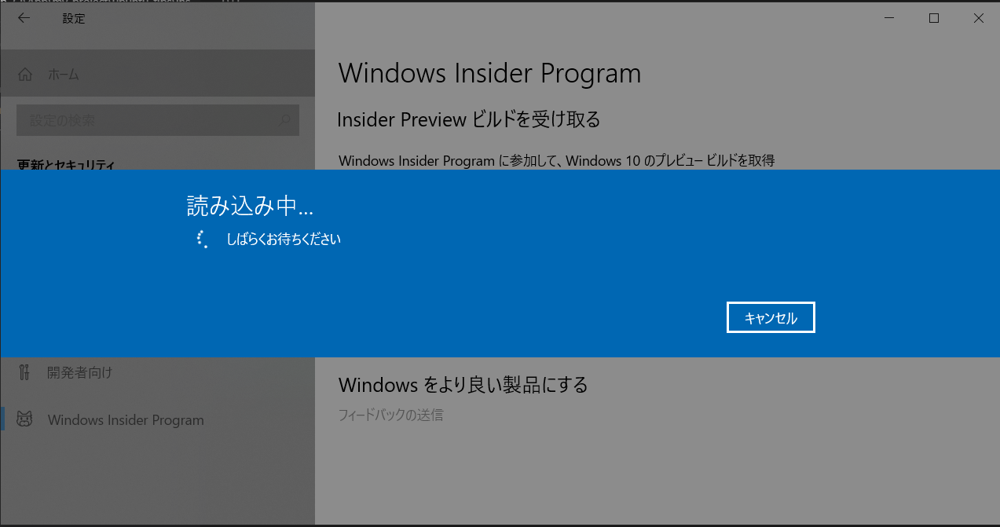

# win-dev-tools

## What's this?

Windowsで開発するときの個人的コマンドラインツール詰め合わせ

***

## Setup

### Environment
- OS: Windows 10 Pro x64
- Editor: VSCode
    - https://code.visualstudio.com/
- CLI: Git bash (Git for Windows)
    - https://gitforwindows.org/

### Preparation
- VSCode と Git for Windows をインストール
    - エクスプローラ拡張も有効化しておくと便利
- VSCodeプラグインをインストール
    - Japanese Language Pack
    - Markdown Preview Enhanced
- VSCode設定(`Ctrl + ,`)
    - ※ 直接`settings.json`を開いて [vscode-settings.jsonc](./vscode-settings.jsonc)の内容をコピペしてもOK
    - `files.eol`:
        - 改行設定 => `\n` (Unix系ツールは`\r`が入っていると動作がおかしくなるものが多いため)
    - `terminal.integrated.shell.windows`:
        - 内部ターミナル => `C:\\Program Files\\Git\\bin\\bash.exe` (Git for Windows のインストール先ディレクトリ)

#### Git bash 起動時にホームディレクトリの .bashrc を読み込むように設定
`C:\Program Files\Git\etc\bash.bashrc` に以下の設定を追加

```bash
# System-wide bashrc file
if [ -f ~/.bashrc ]; then
    . ~/.bashrc
fi
```

#### Git設定
Git bash で以下の設定を行う

```bash
$ git config --global user.name <username> # 好きなユーザ名を設定
$ git config --global user.email <mail@example.dev> # 自分のメールアドレスを設定
$ git config --global core.editor code # VSCodeをデフォルトエディターに
$ git config --global core.autoCRLF false # 改行コードを勝手に修正するのを無効化
$ git config --global core.quotepath false # 日本語ファイル名等をquoteするのを無効化
```

### Installation
```bash
# このリポジトリをclone
# C:ドライブ直下にダウンロードするのがおすすめ
$ cd /c
$ git clone https://github.com/amenoyoya/win-dev-tools.git
```

以下、`C:`ドライブ直下に`win-dev-tools`ディレクトリがある想定でセットアップを行う

`Win + Pause/Break`キー => システム設定のコントロールパネル起動

- システムの詳細設定 > 環境変数
    - システム環境変数の`PATH`に以下のパスを追加
        1. `C:\win-dev-tools\bin`
        2. `C:\win-dev-tools\bin\nodejs`
        3. `C:\win-dev-tools\bin\php-7.3.8`

### Anaconda3
Python環境としてAnaconda3をインストールする

`Win + X`キー |> `A`キー => 管理者権限のPowerShell起動

```powershell
# Windows用パッケージマネージャとして chocolatey 導入
> Set-ExecutionPolicy Bypass -Scope Process -Force; iex ((New-Object System.Net.WebClient).DownloadString('https://chocolatey.org/install.ps1'))

# chocolatey バージョン確認
> choco -v
0.10.15

# anaconda3 インストール
> choco install -y anaconda3
# -> C:\tools\Anaconda3 にインストールされる
```

### bash設定
Git bash で以下を実行

```bash
# C:\users\<User>\.bashrc に以下の設定を記述
# - Anaconda3アクティベーションスクリプト読み込み: Pythonを使用可能に
# - プロンプトに Anaconda環境とGitブランチを表示
## ヒアドキュメント用のアンカー(EOS)を("EOS" or 'EOS' or \EOS)にするとドキュメント内の変数展開をエスケープしてくれる
$ tee ~/.bashrc <<\EOS
source /c/tools/Anaconda3/Scripts/activate

function parse_git_branch {
    git branch --no-color 2> /dev/null | grep '^\*' | sed -e 's/^\*\s*//'
}

function display_git_branch {
    local branch=`parse_git_branch`
    if [ "${branch}" != "" ]; then
        echo " (${branch})"
    fi
}

function parse_anaconda_env {
    conda info -e | grep '\*' | awk '{print $1}'
}

function display_anaconda_env {
    local env=`parse_anaconda_env`
    if [ "${env}" != "" ]; then
        echo "(${env}) "
    fi
}

PS1='\[\e[1;36m\]`display_anaconda_env`\[\e[1;32m\]\u@\h \[\e[1;33m\]\w\[\e[1;34m\]`display_git_branch`\[\e[0;37m\]\n\$ '
EOS

# 現在の bash で設定を反映したい場合は ~/.bashrc を読み込む
$ source ~/.bashrc
```

### Windows Subsystem Linux（WSL）のセットアップ
WSLは何かと有用なので準備しておくと便利

`Win + X` |> `A` => 管理者権限でPowerShell起動

```powershell
# Windows Subsystem Linux を有効化する
> Enable-WindowsOptionalFeature -Online -FeatureName Microsoft-Windows-Subsystem-Linux
この操作を完了するために、今すぐコンピューターを再起動しますか?
[Y] Yes  [N] No  [?] ヘルプ (既定値は "Y"): # そのままENTERして再起動

# 再起動したら Ubuntu 18.04 ディストロパッケージをダウンロード
## 「ダウンロード」ディレクトリに ubuntu1804.appx というファイル名でダウンロード
> Invoke-WebRequest -Uri https://aka.ms/wsl-ubuntu-1804 -OutFile ~\Downloads\ubuntu1804.appx -UseBasicParsing

# ダウンロードしたディストロパッケージをWSLに追加
> Add-AppxPackage ~\Downloads\ubuntu1804.appx
```

スタートメニューに「Ubuntu 18.04」が追加されるため、起動する

```bash
# 初回起動時は初期設定が必要
Installing, this may take a few minutes...
Please create a default UNIX user account. The username does not need to match your Windows username.
For more information visit: https://aka.ms/wslusers
Enter new UNIX username: # ログインユーザ名を設定
Enter new UNIX password: # ログインパスワードを設定
Retype new UNIX password: # パスワードをもう一度入力

# 各種をアップデート
$ sudo apt update && sudo apt upgrade -y
```

### WSL2のインストール
WSL1 では、完全にすべてのLinuxプログラムが動作するわけではない

例えば、複数のDockerコンテナを管理する docker-compose などは動作しない

しかしながら、2020年春提供予定の WSL2 では docker-compose 等も動作するよう改良されているとのことである

2019年12月時点では、Insider Program（バージョン: 18917以降）でしか提供されていないため、利用するには Windows Insider Program への参加が必要である（**動作未保障のためバックアップ必須**）

#### Windows Insider Program 参加
- Windowsスタートメニュー > 設定 > 更新とセキュリティ
    - Windows Insider Program に参加する
        - Microsoftアカウントでのログイン必須のため、アカウントを持っていない場合は新規作成する
        - Insider Preview ビルドの取得に時間がかかるため、場合によっては数時間待機する




#### WSL2 の有効化
`Win + X` |> `A`キー => 管理者権限PowerShell起動

```powershell
# WSL2 を有効化する
> Enable-WindowsOptionalFeature -Online -FeatureName VirtualMachinePlatform
この操作を完了するために、今すぐコンピューターを再起動しますか?
[Y] Yes  [N] No  [?] ヘルプ (既定値は "Y"): # そのままENTERして再起動

# 再起動が完了したらWSLのバージョン確認（1と2は同居可能）
> wsl -l -v

# 先にインストールしていた Ubuntu 18.04 を WSL2 環境にセットする
> wsl --set-version Ubuntu-18.04 2
```

### その他
その他ツールのインストールは [other_installation.md](./other_installation.md) を参照
