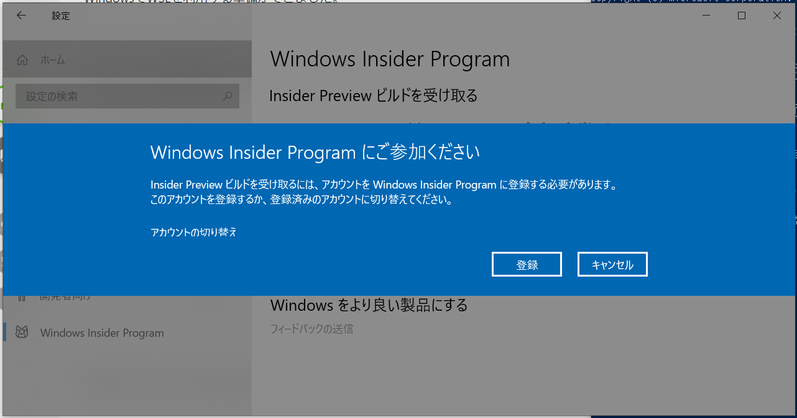

## Windows Subsystem Linux（WSL）の導入

WSLは何かと有用なので準備しておくと便利

※ ただし、VirtualBox や VMware との共存はできないため注意

### Setup
`Win + X` |> `A` => 管理者権限でPowerShell起動

```powershell
# Windows Subsystem Linux を有効化する
> Enable-WindowsOptionalFeature -Online -FeatureName Microsoft-Windows-Subsystem-Linux
この操作を完了するために、今すぐコンピューターを再起動しますか?
[Y] Yes  [N] No  [?] ヘルプ (既定値は "Y"): # そのままENTERして再起動

# 再起動したら Ubuntu 18.04 ディストロパッケージをダウンロード
## 「ダウンロード」ディレクトリに ubuntu1804.appx というファイル名でダウンロード
> Invoke-WebRequest -Uri https://aka.ms/wsl-ubuntu-1804 -OutFile ~\Downloads\ubuntu1804.appx -UseBasicParsing

# ダウンロードしたディストロパッケージをWSLに追加
> Add-AppxPackage ~\Downloads\ubuntu1804.appx
```

スタートメニューに「Ubuntu 18.04」が追加されるため、起動する

```bash
# 初回起動時は初期設定が必要
Installing, this may take a few minutes...
Please create a default UNIX user account. The username does not need to match your Windows username.
For more information visit: https://aka.ms/wslusers
Enter new UNIX username: # ログインユーザ名を設定
Enter new UNIX password: # ログインパスワードを設定
Retype new UNIX password: # パスワードをもう一度入力

# 各種をアップデート
$ sudo apt update && sudo apt upgrade -y

# 開発ツール導入
$ sudo apt install -y build-essential git curl vim ruby openjdk-11-jdk-headless
```

### WSL2のインストール
WSL1 では、完全にすべてのLinuxプログラムが動作するわけではない

例えば、複数のDockerコンテナを管理する docker-compose などは動作しない

しかしながら、2020年春提供予定の WSL2 では docker-compose 等も動作するよう改良されているとのことである

2019年12月時点では、Insider Program（ビルドバージョン: 18917以降）でしか提供されていないため、利用するには Windows Insider Program への参加が必要である（**動作未保障のためバックアップ必須**）

#### Windows Insider Program 参加
- Windowsスタートメニュー > 設定 > 更新とセキュリティ
    - Windows Insider Program に参加する
        - Microsoftアカウントでのログイン必須のため、アカウントを持っていない場合は新規作成する



- どのようなコンテンツの受け取りを希望されますか？
    - => `Windowsのアクティブな開発` を選択
- プレビュービルドを受け取る頻度はどの程度を希望されますか？
    - `スロー` を選択
- 再起動

#### Windows Update
WSL2 を使うためには、ビルドバージョン 18917以降のWindows10である必要があるため、現在のバージョンがそれ以前であるならアップデートを行う

- Windowsスタートメニュー > 設定
    - システム > バージョン情報
        - ここで現在のOSビルドバージョンを確認し、18917以前のバージョンならアップデートを行う
    - 更新とセキュリティ
        - Windows Update を実行する

#### WSL2 の有効化
`Win + X` |> `A`キー => 管理者権限PowerShell起動

```powershell
# WSL2 を有効化する
> Enable-WindowsOptionalFeature -Online -FeatureName VirtualMachinePlatform
この操作を完了するために、今すぐコンピューターを再起動しますか?
[Y] Yes  [N] No  [?] ヘルプ (既定値は "Y"): # そのままENTERして再起動

# 再起動が完了したらWSLのバージョン確認（1と2は同居可能）
> wsl -l -v
  NAME            STATE           VERSION
* Ubuntu-18.04    Stopped         1

# 先にインストールしていた Ubuntu 18.04 を WSL2 環境に変換する
> wsl --set-version Ubuntu-18.04 2

# 「WSL 2 を実行するには、カーネル コンポーネントの更新が必要です。」というエラーが出た場合
## => wsl_update_x64.msi をインストールして再実行する

# 変換が完了したらバージョン確認
> wsl -l -v
  NAME            STATE           VERSION
* Ubuntu-18.04    Stopped         2
```
