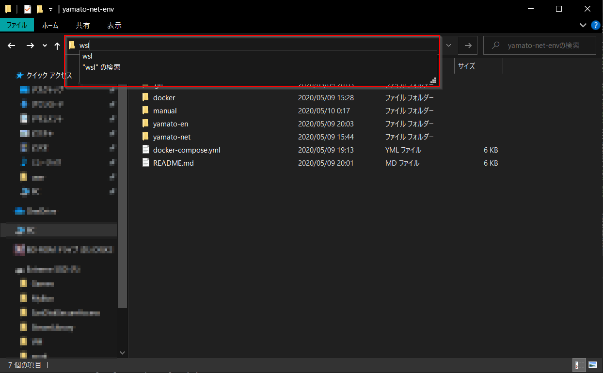

# Windows Subsystem Linux 2（WSL2）の導入

WSL2 を使うと、VirtualBox + Vagrant や VMware を使うよりシームレスに Linux 環境を利用することができる

ただし、VirtualBox, VMware との共存はできないため、WSL2 を使う場合は Vagrant は封印する必要がある

ここでは、WSL2 を導入し、その上に Ubuntu 18.04 をインストール => Docker 環境を構築する

## Environment

- Host OS: Windows 10
- Guest OS: Ubuntu 18.04
    - Docker: 19.03.8
        - docker-compose: 1.24.0
    - nodenv: 1.3.2
        - Node.js: 10.17.0
        - Yarn package manager: 1.22.4

### Setup
まず、WSL1 を導入し、その上に Ubuntu 18.04 をインストールする

`Win + X` |> `A` キー => 管理者権限 PowerShell 起動

```powershell
# Windows Subsystem Linux を有効化する
> Enable-WindowsOptionalFeature -Online -FeatureName Microsoft-Windows-Subsystem-Linux
この操作を完了するために、今すぐコンピューターを再起動しますか?
[Y] Yes  [N] No  [?] ヘルプ (既定値は "Y"): # そのままENTERして再起動

# 再起動したら Ubuntu 18.04 ディストロパッケージをダウンロード
## 「ダウンロード」ディレクトリに ubuntu1804.appx というファイル名でダウンロード
> Invoke-WebRequest -Uri https://aka.ms/wsl-ubuntu-1804 -OutFile ~\Downloads\ubuntu1804.appx -UseBasicParsing

# ダウンロードしたディストロパッケージをWSLにインストール
> Add-AppxPackage ~\Downloads\ubuntu1804.appx

# WSL を起動（Ubuntu 18.04 ターミナルを起動）
> start wsl
```

```bash
# -- Ubuntu 18.04 on WSL

# 初回起動時は初期設定が必要
Installing, this may take a few minutes...
Please create a default UNIX user account. The username does not need to match your Windows username.
For more information visit: https://aka.ms/wslusers
Enter new UNIX username: # <= ログインユーザ名を設定
Enter new UNIX password: # <= ログインパスワードを設定（sudo コマンド実行時等に必要なため忘れないようにする）
Retype new UNIX password: # <= ログインパスワードをもう一度入力

# Linuxシステムアップデート
$ sudo apt update && sudo apt upgrade -y

# 開発ツール導入
$ sudo apt install -y build-essential git curl wget vim ruby openjdk-11-jdk-headless

# Linuxbrew (Linux版の Homebrew パッケージマネージャ) 導入
## Linuxbrew を使うことで最新の開発ツール等を導入しやすくなる
$ sh -c "$(curl -fsSL https://raw.githubusercontent.com/Linuxbrew/install/master/install.sh)"
## PATHを通す
$ echo 'export PATH="/home/linuxbrew/.linuxbrew/bin:$PATH"' >> ~/.bashrc
$ source ~/.bashrc

## Linuxbrew をアンインストールする場合
# $ ruby -e "$(curl -fsSL https://raw.githubusercontent.com/Homebrew/install/master/uninstall)"
## 残ってしまった場合は直接ディレクトリ削除
# $ sudo rm -rf /home/linuxbrew/

# Linuxbrew を使って nodenv 導入
## nodenv を使うことで、複数バージョンの Node.js 環境を構築できる
$ brew install nodenv
## nodenv-yarn-install プラグイン導入: nodenv install 時に yarn もインストールする
$ mkdir -p "$(nodenv root)/plugins"
$ git clone https://github.com/pine/nodenv-yarn-install.git "$(nodenv root)/plugins/nodenv-yarn-install"

# あらかじめ nodenv / Node.js 環境の PATH を通しておく
$ echo 'export PATH="$HOME/.nodenv/shims:$HOME/.yarn/bin:$PATH"' >> ~/.bashrc
$ source ~/.bashrc

# Node.js 10.17.0 インストール
$ nodenv install 10.17.0

# Node.js 10.17.0 に切り替え
$ nodenv global 10.17.0

# 現在選択されているバージョンを確認
$ nodenv versions
* 10.17.0 (set by /home/user/.nodenv/version)

$ node -v
v10.17.0

$ yarn -v
1.22.4
```

### WSL2 へのアップグレード
WSL1 では、完全にすべてのLinuxプログラムが動作するわけではない

例えば、複数のDockerコンテナを管理する docker-compose などは動作しない

一方で、WSL2 はほぼ完全なLinuxカーネルをシミュレートしており、docker-compose 等も動作する

WSL2 は Windows 10 バージョン 2004 で一般提供されているが、それ以前のバージョンの Windows 10 で利用するには Windows Insider Program への参加が必要である

#### Windows Insider Program 参加 & Windows Update
- Windowsスタートメニュー > 設定 > 更新とセキュリティ
    - Windows Insider Program に参加する
        - Microsoftアカウントでのログイン必須のため、アカウントを持っていない場合は新規作成する
        - どのようなコンテンツの受け取りを希望されますか？
            - => `Windowsのアクティブな開発` を選択
        - プレビュービルドを受け取る頻度はどの程度を希望されますか？
            - => `スロー` を選択
- 再起動
- Windowsスタートメニュー > 設定
    - システム > バージョン情報
        - ここで現在のOSビルドバージョンを確認し、18917以前のバージョンならアップデートを行う
    - 更新とセキュリティ
        - Windows Update を実行する

#### WSL2 の有効化
`Win + X` |> `A` キー => 管理者権限 PowerShell 起動

```powershell
# WSL2 を使うために、Windows仮想化機能を有効化
> Enable-WindowsOptionalFeature -Online -FeatureName VirtualMachinePlatform
この操作を完了するために、今すぐコンピューターを再起動しますか?
[Y] Yes  [N] No  [?] ヘルプ (既定値は "Y"): # そのままENTERして再起動

# 再起動が完了したらWSLのバージョン確認
## 現状の Ubuntu 18.04 は Version 1 になっているはず
> wsl -l -v
  NAME            STATE           VERSION
* Ubuntu-18.04    Stopped         1

# 先にインストールしていた Ubuntu 18.04 を WSL2 環境に変換する
> wsl --set-version Ubuntu-18.04 2

# 「WSL 2 を実行するには、カーネル コンポーネントの更新が必要です。」というエラーが出た場合
## => wsl_update_x64.msi をインストールして再実行する

# 変換が完了したらバージョン確認
## Ubuntu 18.04 が Version 2 になっていればOK
> wsl -l -v
  NAME            STATE           VERSION
* Ubuntu-18.04    Stopped         2
```

***

## Docker 環境構築

### Docker とは
- **Docker**
    - OS・ミドルウェア・ファイルシステム全体を**イメージ**という単位で取り扱い、まるごとやりとり出来るツール
    - **特徴**:
        - Docker仮想環境は**コンテナ型**と呼ばれるもので、Linuxカーネルに直接アクセスするためオーバーヘッドが少ない
        - 環境構築が容易（`Dockerfile`に環境設定を記述するだけで、必要な環境を自動で構築してくれる）
        - コンテナは移植性(ポータビリティ)が高く、Dockerさえインストールされていれば、全く同じ環境でアプリを動かせる
        - ホストOSからはコンテナは１プロセスとして認識される
    - **Dockerが解決するもの**:
        - Dockerはアプリケーションとその実行環境を統合的に管理する為のソリューションであるため、開発環境におけるOSレベルのライブラリ、ミドルウェアのバージョン、環境設定は、常に本番環境と同じものにすることが可能
        - すなわち、本番環境へのデプロイ時の最大の不安要素が解消される
    - **Dockerの原則**:
        1. 1コンテナにつき1プロセス
            - 1つのコンテナ内に複数プロセス(例: Rails, Nginx, MySQL)を詰め込むと、コンテナの再起動などが気軽にできない
        2. コンテナ内で完結させる
            - 使用するミドルウェアやツールなどはすべてホスト側ではなくコンテナ上で管理すること　
            - これにより、バージョンアップやメンテは`Dockerfile`上で管理できる

### Ubuntu 18.04 on WSL2 に Docker 環境を構築する
Ubuntu 18.04 on WSL2 は、Windowsスタートメニューの「Ubuntu 18.04」から起動できる

もしくは PowerShell で `start wsl` コマンドでも起動可能

あるいは、エクスプローラのアドレスバーに `wsl` と打てばエクスプローラで開いているディレクトリ内で起動することも可能



```bash
# -- Ubuntu 18.04 on WSL2

# Docker (Community Edition) インストール
$ sudo apt install -y apt-transport-https ca-certificates software-properties-common
$ curl -fsSL https://download.docker.com/linux/ubuntu/gpg | sudo apt-key add -
$ sudo add-apt-repository "deb [arch=amd64] https://download.docker.com/linux/ubuntu bionic stable"
$ sudo apt update && sudo apt install -y docker-ce
## dockerデーモン起動
$ sudo service docker start

# WSL2 では、デーモンをスタートアップに登録することができない
# スタートアップに登録したい場合は、Windowsのタスクスケジューラに登録する必要がある
# 参考: https://qiita.com/Ningensei848/items/75adeb29bb143633d60c

# Windows再起動の度に sudo service docker start すれば良いだけなので、ここではスタートアップ登録までは行わない

# docker-compose 導入
$ sudo curl -L https://github.com/docker/compose/releases/download/1.24.0/docker-compose-`uname -s`-`uname -m` -o /usr/local/bin/docker-compose
$ sudo chmod +x /usr/local/bin/docker-compose

# Dockerを sudo なしで実行可能に
## ※ カレントユーザーをdockerグループに所属させた上で docker.sock へのグループ書き込み権限を付与すればよい
$ sudo gpasswd -a $USER docker
$ sudo chgrp docker /var/run/docker.sock
$ sudo service docker restart

# 一度ログアウトしないと反映されないため、一旦 exit
$ exit
```

### 動作確認
```bash
# -- Ubuntu 18.04 on WSL2

# 動作確認用 docker構成 をダウンロード
## Let's Encrypt で SSL 化 + vhost 環境の Apache:2.4 PHP:7.3 コンテナ
$ wget -O - https://github.com/amenoyoya/docker-collection/releases/download/0.2.1/letsencrypt-nginx-proxy.tar.gz | tar zxvf -
$ cd letsencrypt-nginx-proxy/

# Dockerデーモンを起動していない場合は起動
$ sudo service docker start

# Dockerコンテナビルド＆起動
$ export UID && docker-compose build
$ docker-compose up -d
```

仮想ホスト（ローカルドメイン）を有効化するために、`Win + X` |> `A` キー => 管理者権限 PowerShell 起動

```powershell
# hostsファイルをメモ帳で編集
> notepad C:\windows\system32\drivers\etc\hosts
### <hosts>
# 以下の行を追加: https://web.local/ => 127.0.0.1 (localhost) に関連付け
127.0.0.1    web.local
::1          web.local
### </hosts>

# DNSキャッシュをクリアして、仮想ホスト設定を反映
> ipconfig /flushdns
```

ここまで実行し、ブラウザで https://web.local/ にアクセスする

これで、phpinfo の内容が表示されたら動作確認は完了

Dockerコンテナを停止する

```bash
$ docker-compose stop
```

### Dockerコンテナを起動する度にメモリが圧迫される場合
2020年5月時点の WSL2 は、Dockerコンテナ作成時にメモリリークが起こるバグがある

この場合は、WSL2 システムを一旦シャットダウンすれば解消する

PowerShell を起動し、以下のコマンドを実行

```powershell
# WSL2 をシャットダウン
> wsl --shutdown
```
